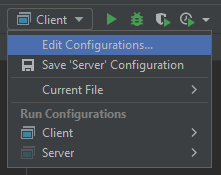
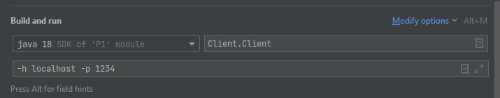

# Software Distribuït 2023

| Professor    | Mail            | Classes                                                               |
|--------------|-----------------|-----------------------------------------------------------------------|
| Eloi Puertas | epuertas@ub.edu | Teoria, dimecres de 15 a 17h. Pràctiques, dijous de 17 a 19h (Grup B) |
| Blai Ras     | blai.ras@ub.edu | Pràctiques, dimecres de 17 a 19h (Grup F) i de 19 a 21h (Grup A)      |

## Avaluació

* Es treballarà amb GitHub Classroom, on cada parella tindrà un repositori. És obligatori que tota la feina realitzada es vegi **contrastada a GitHub de manera continuada**, és a dir, no pot haver-hi un "push" enorme el dia abans de l'entrega amb tot el codi de la P1. A l'apartat de P1 trobareu totes les directrius a seguir.

* L'assistència a classe és obligatoria. A cada sessió el professor explicarà el progrès a realitzar de la pràctica, a part de resoldre dubtes. Cada dues sessions, els últims 10-15 minuts estàn reservats per a un qüestionari obligatori sobre temari de teòria i pràctiques que s'ha tractat durant les dues últimes setmanes. Aquest qüestionari és individual, sense internet, està cronometrat i només es podrà realitzar un sol cop.

* No hi ha exàmen parcial

| Concepte                                                      | Tipus de nota | Pes |
|---------------------------------------------------------------|---------------|-----|
| Codi P1                                                       | Col·lectiva   | 0.5 |
| Qüestionari cada 15 dies                                      | Individual    | 0.3 |
| Avaluació de GitHub (Pull Requests, Feedback, continuïtat...) | Individual    | 0.2 |

## P1 - Client / Servidor

La practica 1 consisteix en implementar un joc senzill amb arquitectura Client-Servidor fent servir Sockets amb Java. Establirem un protocol i els seus estats a seguir de manera que qualsevol grup podrà testejar el seu Client contra qualsevol Servidor d'un altre grup, i viceversa.

* Es programarà en Java. Es recomana usar una SDK recent, per exemple, la 18. És també recomanat l'ús de Linux.
* Es seguirà estrictament la [guia d'estil de JAVA](https://google.github.io/styleguide/javaguide.html) per la primera pràctica tan pel que fa al codi com a la documentació.
* Podeu fer servir el IntelliJ IDEA amb llicència d'estudiant de la UB que integra en l'IDE  eines per a [Github](https://www.jetbrains.com/help/idea/github.html) i per [reformatar codi segons una guia d'estil](https://medium.com/swlh/configuring-google-style-guide-for-java-for-intellij-c727af4ef248)
* La última sessió de cada pràctica serà de testing creuat.

**Avaluació de GitHub**

* El conjunt de **commits** d'un membre de la parella dins la seva branca s'hauran de revisar (**code review**) per l'altra membre abans de fer _merge_ a la branca principal. Es farà mitjançant[ **Pull Requests**,](https://docs.github.com/en/github/collaborating-with-issues-and-pull-requests/proposing-changes-to-your-work-with-pull-requests) per tant no es podrà seguir desenvolupant fins que l'altre membre de la parella no acceptin els canvis en el codi proposats. Es poden fer tants PR com es vulgui, com mes _feedback_ entre la parella, millor.
* Per acceptar els canvis, el revisor ha de llegir-se el codi, comprovar que segueix els estàndards i provar els tests.  En cas de trobar coses per millorar o TESTS que faltin, ho ha d'explicar en el comentaris del  **Pull Request** i no acceptar els canvis fins que l'altra ho millori. En cas de que estigui tot correcte ha de comentar els canvis realitzats i les proves que ha fet.  

### Sessió 0

En aquesta sessió donem a conèixer el codi base, s'expliquen les diferents parts i com millorar-lo. En aquesta sessió teniu dos projectes: Client i Servidor. Obriu cadascún com a dos projecetes separats a IntelliJ. 

### Execució 

L'execució seguirà obligatòriament els següents paràmetres:

**Servidor**
* -p: port a on establir-se

**Client**

* -h: IP o nom de la màquina a on connectar-se
* -p: port on trobar el servidor

Podeu executar-ho usant la consola, o podeu editar les _run configurations_ del projecte tal i com es mostra a continuació:

i després...

#### Tasques a realitzar per a la sessió 1

* Documentarse sobre [Sockets en Java](https://docs.oracle.com/javase/7/docs/api/java/net/Socket.html)
* Entendre el codi base, executar-lo i experimentar.
* Modificar el codi per a implementar les classes GameHandler i GameClient.

# README ENTREGA

### Com funciona el codi?
 * Resumidament, el codi implementa una arquitectura Client-Servidor per a jugar a Dan-Dan-Dish. El servidor escolta un port per on els clients es connecten, i per a cada client que es connecta, crea un nou objecte GameHandler per processar la comunicació amb aquest client. El core del funcionament de la pràctica són les classes GameHandler i GameClient, que contenen la lògica del fil d'execució de la partida i estan preparades per mantenir un sistema d'enviament i recepció de trames. A partir d'aqui es van cridant a mètodes de GameProtocol i ClientProtocol que fan ús de la llibreria de la classe Utils pel control de trames. Bàsicament, els handlers son els que s'encarreguen de llegir els opcodes enviats pel Server i el Client. Segons l'opcode entra en l'estat corresponent.

### Com compilar el codi?
 * El nostre sistema està compost per un servidor i un client que han de comunicar-se per realitzar les seves tasques. Per a això, hem de configurar els paràmetres d'execució dels programes. En el cas del servidor, ens cal especificar el port on volem que es connectin els clients. Aquesta configuració s'especifica amb el paràmetre "-p". Així doncs, si volem que el servidor escolti en el port 1234, hauríem de posar "-p 1234" en la configuració d'execució del servidor. D'altra banda, en el client necessitem especificar la IP o el nom de la màquina on es troba el servidor al qual volem connectar-nos. Aquesta configuració s'especifica amb el paràmetre "-h". Així, si el servidor està en una màquina amb la IP 192.168.0.1, hauríem de posar "-h 192.168.0.1" en la configuració d'execució del client. Finalment, també hem de posar el port en el qual el servidor escolta les connexions. Això s'especifica amb el paràmetre "-p". Si el servidor escolta en el port 1234, hauríem de posar "-p 1234" en la configuració d'execució del client. 
 * Per fer més senzilla l'execució dels programes, hem creat dues aplicacions en Java amb les configuracions d'execució predefinides. Així, només hem de llançar l'aplicació del servidor en una màquina i l'aplicació del client en una altra màquina, i la comunicació es farà de forma automàtica. Això ens ajuda a estalviar temps i evitar errors en la configuració dels paràmetres d'execució. Hem guardat aquestes configuracions com arxius i un cop recuperes el zip es recuperen també les configuracions.
 * El codi ha estat escrit amb l'SDK 17 i Language Level 8 i executat i compilat desde l'IDE IntelliJ. 
 * Quan enganxem el .jar al projecte, hem de crear les dependències corresponents a aquests. Amb IntelliJ es fa desde Project Structure --> Modules, allà selecciones el projecte que vols configurar(Server/Client) i hi ha un signe de +. Es clica i triem el .jar que ens sortirà dins de la carpeta de la pràctica. Ho fem amb Server i Client i ja podem executar el codi sense problemes.

### Que ens ha costat més?
 * Durant la nostra pràctica per implementar una arquitectura Client-Servidor, ens hem enfrontat a diversos reptes. Un dels aspectes que més ens ha costat ha estat la readaptació del codi per a poder incloure correctament el sistema d'errors. En particular, les classes protagonistes en quant a canvis són Game Client i Game Handler, que són, de fet, les encarregades de contenir la lògica del fil d'execució de les partides, i per tant, són essencials per al correcte funcionament del joc. En un principi, el codi estava mal estructurat (podeu comprovar-ho en anteriors versions del codi) i això va suposar un gran desafiament per a nosaltres. En les versions prèvies, el flux del programa es basava en una suposició que no hi hauria errors en l'execucuió, i era un flux molt seqüencial. No llegíem l'opcode i posavem l'estat, si no que posavem l'opcode segons l'estat i això ens va portar problems sobretot a l'hora de jugar una segona partida amb la mateixa ID. 
 *  No obstant, hem aconseguit finalment estructurar el codi de manera més eficient i adaptar-lo al sistema d'errors que volíem implementar. Això ha suposat un gran esforç per part de tot el nostre equip, ja que ha estat necessari canviar i reescriure grans parts del codi original. En definitiva, la implementació d'una arquitectura Client-Servidor és una tasca complexa que requereix una gran dedicació i investigació. En el nostre cas, la readaptació del codi ha estat el principal repte a superar, però finalment hem aconseguit una solució funcional per al nostre joc. 
 * Un altre dels problemes més destacables ha estat la comprensió de l'Unicode Transformation Format (UTF) i l'enviament de trames. Aquesta també ha estat una qüestió crucial per a nosaltres, ja que el joc que estàvem implementant requeria la comunicació entre el client i el servidor mitjançant trames codificades en UTF. Inicialment, ens va costar entendre la sintaxi i la manera en què les dades havien de ser codificades per a ser enviades a través de les trames. Això va comportar errors en l'enviament i recepció de les dades, i en ocasions la informació que rebíem no era la que esperàvem. No obstant, gràcies a la investigació i al treball en equip, vam aconseguir entendre correctament com havíem de codificar i enviar les dades. 

# Sessió de Testing:
Durant la sessió de testing hem observat diferents errors en el nostre codi. En la majoria de casos on nosaltres erem el client, ens hem trobat amb que al enviar l'string amb l'usuari, el servidor no llegia el nom i el flux del programa s'aturava. Amb 4 grups ens ha funcionat correctament, però el fet que ens hagi fallat amb la majoria de grups demostra que hem de canviar la manera d'enviar l'string amb els dos zeros al final.Durant el testing ho hem intentat fer amb el metode writeShort(), i ho hem de canviar a writeByte() 
En els casos que nosaltres feiem de servidor, si que a la majoria de casos el programa deixava completar les partides, però no llegia el nom de l'usuari del client. Alguns usuaris han assenyalat que en el cas de la segona partida, un cop acabava la primera, en ocasions disparàvem sense bales. 

# Nosaltres com a Client:
SERVER|CLIENT|Resultat|
------|------|------|
 B01  | B02|   El nostre client no envia de la manera adient l'string amb el nom i no podem avançar en el flux del programa.|
 B02  | B02|   Funciona correctament, podem tornar a fer una partida i salten alguns errors.✅|
 B03  | B02|   B03 no dona IP.|
 B04  | B02|   Aconseguim fer una partida sencera, tot correcte.✅|
 B05  | B02|   El nostre client no envia de la manera adient l'string amb el nom i no podem avançar en el flux del programa.|
 B06  | B02|   El nostre client no envia de la manera adient l'string amb el nom i no podem avançar en el flux del programa.|
 B07  | B02|   El nostre client no envia de la manera adient l'string amb el nom i no podem avançar en el flux del programa.|
 B08  | B02|   No aconseguim connectar, malgrat posar tots els paràmetres correctament vàries vegades.|
 B09  | B02|   Aconseguim fer una partida sencera, tot correcte.✅|
 B10  | B02|   El nostre client no envia de la manera adient l'string amb el nom i no podem avançar en el flux del programa.|
 B11  | B02|   Detectem que en la partida ells disparen sense bales. Obviant aquest problema, el flux del programa és el correcte.✅|
 B12  | B02|   El nostre client no envia de la manera adient l'string amb el nom i no podem avançar en el flux del programa.|
 B13  | B02|   Aconseguim fer una partida sencera, tot correcte.✅|
 B14  | B02|   El nostre client no envia de la manera adient l'string amb el nom i no podem avançar en el flux del programa.|
 B15  | B02|   El nostre client no envia de la manera adient l'string amb el nom i no podem avançar en el flux del programa.|
 
# Nosaltres com a Servidor:
 
SERVER|CLIENT|Resultat|
 -----|------|------|
 B02  | B01|   Aconseguim fer una partida sencera.✅|
 B02  | B02|   Aconseguim fer una partida sencera.✅|
 B02  | B03|   B03 no dona IP.|
 B02  | B04|   Aconseguim fer una partida sencera però detecten que en algun moment nosaltres disparem sense bales.|
 B02  | B05|   El flux s'atura al ADMIT.|
 B02  | B06|   Aconseguim fer una partida sencera.✅|
 B02  | B07|   No s'han connectat a nosaltres.|
 B02  | B08|   No s'han connectat a nosaltres.|
 B02  | B09|   Aconseguim fer una partida sencera.✅|
 B02  | B10|   No s'han connectat a nosaltres.|
 B02  | B11|   Aconseguim fer una partida sencera.✅|
 B02  | B12|   Aconseguim fer una partida sencera però detecten que en algun moment nosaltres disparem sense bales.|
 B02  | B13|   Aconseguim fer una partida sencera però detecten que en algun moment nosaltres disparem sense bales.|
 B02  | B14|   Aconseguim fer una partida sencera però detecten que en algun moment nosaltres disparem sense bales.|
 B02  | B15|   Aconseguim fer una partida sencera.✅|
